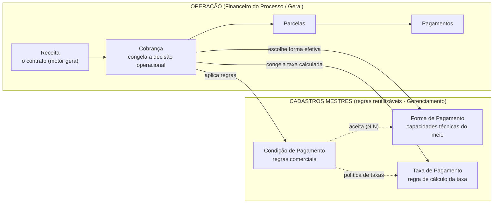

# Arquitetura — Cadastros de Pagamento (Forma · Condição · Taxa)

> Documento de domínio. Fonte única para a evolução conjunta dos três cadastros
> mestres do motor financeiro. Fecha a arquitetura **antes** da implementação
> incremental. Nada aqui congela dados de Cobrança/Receita/Pagamento.

## 0. Princípios

1. **Conjunto arquitetural único.** Forma, Condição e Taxa são as três peças de
   configuração do mesmo motor. Evoluem juntas, com a mesma linguagem e a mesma
   identidade visual premium do módulo Financeiro.
2. **Fonte única da verdade.** Cada conceito existe uma única vez. Ninguém copia,
   duplica, espelha ou sincroniza cadastro. Consumo sempre por **ID**, via
   `FinancialConfigurationService` (leitura) e `PaymentMethodService` (regras).
3. **Configuração ≠ Operação.** Os três cadastros são **regras reutilizáveis**.
   Eles nunca representam uma cobrança real nem congelam cliente, conta, carteira,
   cotação, datas ou valores efetivos. Quem congela é a **Cobrança**.
4. **Aditivo, reversível, sem downtime, sem perda de dado.** Toda mudança de banco
   é migration aditiva (`ADD COLUMN IF NOT EXISTS`); nada é dropado. Conceitos
   legados são *desativados na UI* e *derivados/preservados* no banco para compat.

---

## 1. Fluxo completo

**Narrativa.** A Receita é o contrato. Ao criar uma **Cobrança**, o usuário
escolhe uma **Condição** (regras comerciais) e uma **Forma** efetiva entre as
aceitas; o sistema consulta as **Taxas** compatíveis com aquela Forma, aplica a
**política de taxas** da Condição, calcula e **congela** o resultado na Cobrança.
Só a Cobrança grava conta, carteira, gateway, cotação, datas e valores. As
Parcelas e os Pagamentos derivam da Cobrança — nunca da Receita direto.

---

## 2. Responsabilidades (o que cada entidade responde)

| Entidade | Responde a | NUNCA define |
|---|---|---|
| **Forma de Pagamento** | Que meio é este? Quais moedas aceita? Parcela? Limite técnico? Aceita entrada/recorrência/internacional? Estorno/reembolso? Integração? Quais destinos (carteiras/contas) são compatíveis? Prazo de liquidação? | Nº comercial de parcelas · cronograma · vencimentos · juros/multa/desconto · valor de taxa · adquirente/conta escolhidos · cliente · cobrança |
| **Condição de Pagamento** | Quais regras usar ao criar uma Cobrança? Parcelamento, cronograma, entrada, vencimento, distribuição, encargos, aplicabilidade, formas aceitas, **política** de taxas e câmbio | Cliente · conta/carteira usada · forma efetivamente escolhida · datas reais · valores finais · cotação congelada · pagamento · cobrança |
| **Taxa de Pagamento** | Quanto cobrar? Como calcular? Quando aplicar? Quem absorve? Em quais cenários? | Cliente · cobrança · receita · pagamento · parcelas geradas · cronograma · conta/carteira/gateway da operação |
| **Cobrança** *(já existe)* | Combina Forma+Condição+Taxa e **congela** a decisão operacional efetiva | — (é a camada concreta) |

**Invariantes duros**
- A Taxa depende da **Forma escolhida na Cobrança** — nunca é congelada na Condição.
- A Condição só **sugere** (forma sugerida, carteira sugerida, política cambial); a decisão é da Cobrança.
- A Forma só descreve **capacidade técnica**; regra comercial é da Condição.
- Validação de compatibilidade **centralizada** no `PaymentMethodService` (nunca espalhada em componentes/endpoints).

---

## 3. Relacionamentos

- `CondicaoPagamento` **N:N** `FormaPagamentoCadastro` → `CondicaoPagamentoForma` (formas aceitas).
- `CondicaoPagamento` **N:N** `TaxaPagamento` → `CondicaoPagamentoTaxa` (mantido; a política nova rege *como* se aplicam).
- `CondicaoPagamento.formaSugeridaId` → `FormaPagamentoCadastro` (ref. solta, sugestão).
- `TaxaPagamento.formasAplicaveis[]` → `FormaPagamentoCadastro` (múltiplas; ref. solta por ID).
- `FormaPagamentoCadastro.carteirasCompativeis[] / contasCompativeis[]` → `CarteiraRecebimento` / `ContaBancaria` (destinos compatíveis, ref. por ID).
- `Cobranca.{formaPagamentoId, condicaoPagamentoId, taxaPagamentoId, contaBancariaId, carteiraId, gateway}` → todos por **ID** (fonte única, nunca cópia). **Sem alteração** nesta reforma.
- Cadastros de apoio já existentes e reaproveitados: `MoedaCadastro`, `CarteiraRecebimento`, `ContaBancaria`, `Banco`. **Não existe** cadastro de Adquirente/Gateway → adquirente vira **enum controlado** (sem nova tabela, respeitando a diretriz de não adicionar complexidade sem uso real).

---

## 4. Campos: permanece · muda · deixa de existir

Legenda: **Permanece** (mantido como está) · **Muda** (renomeia/semântica/condicional) · **Novo** (aditivo) · **Legado desativado** (some da UI; coluna preservada no banco para compat, valor derivado).

### 4.1 Forma de Pagamento (`FormaPagamentoCadastro`)

| Situação | Campos |
|---|---|
| **Permanece** | `id`, `code`, `name`, `ativo`, `ordem`, `icone`, `observacoes`, `permiteParcelas`, `maxParcelas` (= limite **técnico**), `aceitaEntrada`, `aceitaRecorrencia`, `aceitaMoedaEstrangeira` |
| **Muda** | `type` string livre → **enum controlado** (PIX, TRANSFERENCIA, BOLETO, CARTAO_CREDITO, CARTAO_DEBITO, DINHEIRO, WISE, STRIPE, PAYPAL, GATEWAY, OUTRO) · `permiteParcelas`+`maxParcelas` reenquadrados como seção **“Capacidade de parcelamento”** (só limite técnico) |
| **Novo** | `descricao`, `categoria?` · **`moedasAceitas[]`** (multi, de `MoedaCadastro`) · capacidades: `permiteCancelamento`, `permiteEstorno`, `permiteReembolso`, `permiteInternacional`, `liquidacaoAutomatica`, `conciliacaoAutomatica`, `permiteComprovante`, `emissaoAutomatica`, `permiteCobrancaManual` · integração: `tipoIntegracao` (MANUAL/BANCO/GATEWAY/ADQUIRENTE/CARTEIRA/NENHUMA), `provedorIntegracao`, `integracaoAtiva` · destinos: `carteirasCompativeis[]`, `contasCompativeis[]` · liquidação: `prazoLiquidacao` (IMEDIATO/D0/D1/D2/DN), `diasLiquidacao`, `diasCorridos`, `permiteAntecipacao` · flags de taxa (não valores): `utilizaTaxas`, `permiteTaxaAntecipacao`, `permiteTaxaParcelamento`, `permiteTaxaInternacional` |
| **Legado desativado** | `moeda` (única) → substituída por `moedasAceitas[]`; coluna preservada só p/ backfill |

### 4.2 Condição de Pagamento (`CondicaoPagamento`) — *model já rico*

| Situação | Campos |
|---|---|
| **Permanece** | `name`, `codigo`, `descricao`, versionamento (`versao`, `substituiId`), `vigenciaInicio/Fim`, `tipoPagamento`, `temEntrada`, `percentEntrada`, `valorEntradaFixo`, `entradaObrigatoria`, `parcelas`, `parcelasMin/Max/Padrao`, `permiteParcelasPersonalizadas`, `permiteEdicaoManual`, `inicioCronograma`, `primeiraParcelaDias/Data`, `periodicidade/Dias`, `diaFixo`, `ajusteDiaUtil`, `distribuicao`, `multa/juros/desconto*`, `moedasPermitidas`, `valorMin/Max`, `paises`, `modalidades`, `tiposProcesso`, `observacoes`, `formasPermitidas` (N:N), `taxasVinculadas` (N:N), `carteiraId` |
| **Muda** | `carteiraId` → rótulo **“Carteira sugerida”** (opcional) · `politicaCambio` → **“Política Cambial Padrão”** (PADRAO_SISTEMA/SUGERIR_VARIAVEL/SUGERIR_TRAVA) · `aplicaA` (RECEITA/CUSTO/AMBOS) → rótulos **“Contas a Receber / Contas a Pagar / Ambos”** · `distribuicao` amplia (IGUAIS, PRIMEIRA_MAIOR, ULTIMA_MAIOR, ENTRADA_FIXA, ENTRADA_PERCENTUAL, PERSONALIZADO) |
| **Novo** | **`politicaTaxas`** (IGNORAR/REPASSAR/ABSORVER/ESCOLHER_NA_COBRANCA) · **`formaSugeridaId`** (Forma sugerida) · entrada: `entradaTipo`, `entradaMin/Max`, `entradaCompoeTotal`, `entradaAdicional` · cronograma explícito: `diaInexistente` (ULTIMO_DIA/PROX_UTIL/ANT_UTIL), `comportamentoFimSemana`, `comportamentoFeriado` · encargos: `multaTipo`+`multaValor`, `jurosTipo`+`jurosPeriodo`, `carenciaDias`, `descontoTipo`, `descontoAntecipacaoAuto`, `quemConcedeDesconto` · aplicabilidade: `perfil`, `canal` · **`servicos[]`** (restringe a Serviços Financeiros) |
| **Legado desativado** | **`formaPagamento`** (enum “Forma padrão (legado)”) → substituído por `formaSugeridaId` · **`moeda`** (“Moeda do cadastro”) → só `moedasPermitidas` · **`aplicarTaxas`** (bool) + “Aplicar taxas nesta condição / Cartão” → substituído por `politicaTaxas` · `travaCambial` → derivado de `politicaCambio` |

### 4.3 Taxa de Pagamento (`TaxaPagamento`)

| Situação | Campos |
|---|---|
| **Permanece** | `code`, `name`, `ativo`, `vigenciaInicio/Fim`, `feeType` (só os reais: Percentual, Valor fixo, Percentual + fixo), `feePercent`, `fixedFee` |
| **Muda** | `formaPagamentoId` (única) → **`formasAplicaveis[]`** (múltiplas; single preservada p/ compat) · `moeda` **condicional** (oculta se percentual; exibida se valor fixo) · `installmentsFrom/To` → **`aplicaParcela`** (TODAS/ENTRADA/PRIMEIRA/ULTIMA/FAIXA; from/to só em FAIXA) · `anticipationEnabled` → **`anticipationType`** (NAO_POSSUI/OPCIONAL/OBRIGATORIA) + `anticipationFixed` + `anticipationMinDays` · `baseIncidencia` amplia (TOTAL/PARCELA/SALDO/ENTRADA/LIQUIDO/BRUTO) · `quemAbsorve` amplia (EMPRESA/CLIENTE/COMPARTILHADA/COBRANCA) + `absorcaoPercentEmpresa` · `adquirente` texto livre → **enum controlado** (STONE/CIELO/REDE/PAGSEGURO/STRIPE/WISE/OUTRO) |
| **Novo** | `descricao`, `categoria` (Taxa Cartão/Tarifa Bancária/Gateway/Antecipação/IOF/Spread Cambial) · **`prioridade`** · regras de aplicação: `paises[]`, `moedasAplicaveis[]`, `servicos[]`, `modalidades[]`, `tiposProcesso[]`, `valorMin/Max`, `canal`, `gateway`, `perfil` · câmbio: **`momentoCambio`** (ANTES_CONVERSAO/APOS_CONVERSAO/MOEDA_CONTRATUAL/MOEDA_LIQUIDACAO) |
| **Legado desativado** | `adquirente` como texto livre (vira enum) |
| **Fora de escopo (diretriz do usuário)** | ❌ `feeType` “Faixa progressiva” e “Tabela externa” — só entram com caso de uso real; interface permanece enxuta |

---

## 5. Serviços (regras centralizadas — o frontend só consome)

### 5.1 `FinancialConfigurationService` (leitura — já existe, **ampliar**)
Continua a fonte única de leitura agregada. Amplia o payload para expor os novos
campos: capacidades e `moedasAceitas`/destinos da Forma, `politicaTaxas`/
`formaSugeridaId`/`servicos` da Condição, `formasAplicaveis`/categoria/regras da Taxa.

### 5.2 `PaymentMethodService` (regras — **novo**, na Fase 1)
Único dono das validações de compatibilidade. Nunca duplicar em componente/endpoint.
- `listarFormasAtivas()`
- `validarCompatibilidadeCondicao(forma, condicao)` → moeda ⊆ moedasAceitas; `maxParcelas ≥ condicao.parcelasMax`; recorrência; entrada.
- `validarCompatibilidadeCobranca(forma, ctx)` → moeda/país/capacidade/vigência/ativo/destino compatível.
- `resolverTaxasCompativeis(forma, condicao, ctx)` → taxas aplicáveis àquela Forma + política da Condição.

O cálculo de taxa permanece no motor puro `lib/financeiro/taxas-pagamento.ts`; o
cronograma no `lib/financeiro/condicao-pagamento.ts`. A Cobrança é a única que
transforma regra em valor efetivo e congela.

---

## 6. Identidade visual & UX (compartilhada)

- **Shell premium reutilizável** para os três cadastros: fundo europeu, overlay
  `bg-black/60 backdrop-blur-sm`, glass `rounded-xl border-white/10 bg-white/[0.05]`,
  ouro `#D2A948`, tipografia e espaçamento do Financeiro. Zero cara de CRUD.
- **Forma:** tela/painel premium por seções com *disclosure progressivo* (esconde
  parcelas se não parcela, provedor se sem integração, etc.).
- **Condição:** **wizard** — Identificação → Aplicabilidade → Parcelamento →
  Cronograma → Formas → Política de Taxas → Política Cambial → Encargos → Revisão.
- **Taxa:** **wizard enxuto** — Identificação → Tipo de cálculo → Incidência →
  Absorção → Aplicabilidade → Vigência → Revisão.

---

## 7. Plano de implementação incremental

**Ordem recomendada: fundação-primeiro** (`Forma → Taxa → Condição`), porque a
Condição referencia as duas e a validação de compatibilidade depende das
capacidades da Forma. Minimiza retrabalho. Cada fase é um deploy independente.

| Fase | Cadastro | Entrega |
|---|---|---|
| **1** | Forma de Pagamento | schema aditivo · `PaymentMethodService` · API/serviço · UI premium (disclosure) · testes · deploy |
| **2** | Taxa de Pagamento | schema aditivo · múltiplas formas · incidência/absorção/adquirente enum · regras+câmbio · wizard premium · testes · deploy |
| **3** | Condição de Pagamento | schema aditivo (já esboçado) · política de taxas/cambial · entrada/cronograma/encargos · serviços · wizard premium · validação de compatibilidade · testes · deploy |

**Procedimento fixo por fase (aditivo, sem downtime):**
1. `ADD COLUMN IF NOT EXISTS` (migration idempotente) + `prisma generate`.
2. Ampliar `FinancialConfigurationService` / criar regras no `PaymentMethodService`.
3. API (validação server-side, permissão `usuarios.gerenciar`).
4. UI premium (shell compartilhado) com disclosure progressivo.
5. Testes estruturais + de compatibilidade; `next build`.
6. Commit; `vercel --prod` → o `prod-migrate-guard` aplica a migration em produção (onde as variáveis Sensitive existem) **antes** do código novo entrar no ar.
7. Verificação em produção.

**Compatibilidade/migração:** nenhum registro apagado; colunas legadas
preservadas; valores derivados (`aplicarTaxas`←`politicaTaxas`, `travaCambial`←
`politicaCambio`, `moeda`←`moedasAceitas`) mantêm o comportamento atual até o
backfill. Só se remove coluna legada depois de validação — e mesmo assim,
opcionalmente, em fase separada.

---

## 8. Estado atual (staged, local, não commitado)

Esboço da Fase 3 já iniciado e **alinhado** a este documento (revertível):
`schema.prisma` (campos aditivos na Condição), `campos.ts` (novos enums) e a
migration `20260729000000_condicao_regra_reutilizavel`. Nada foi commitado nem
deployado; será ajustado se a revisão desta arquitetura pedir.
