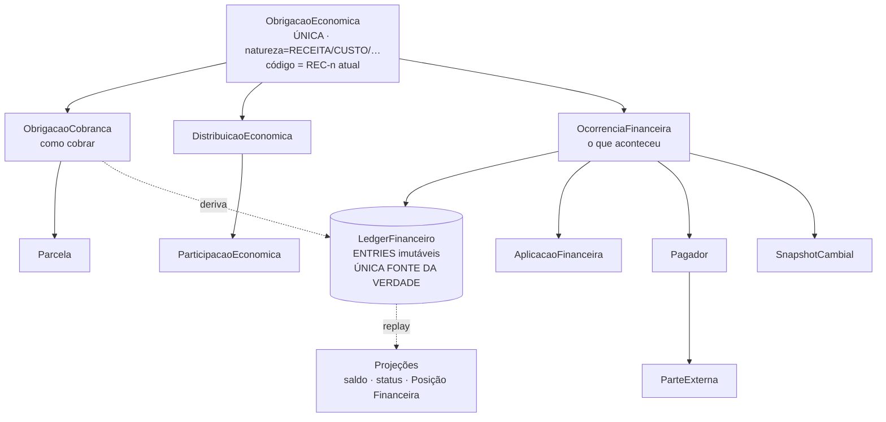
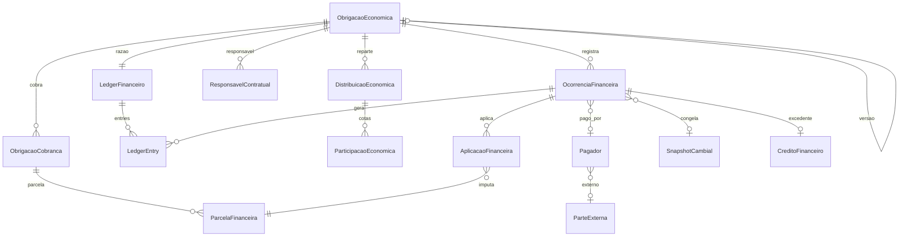
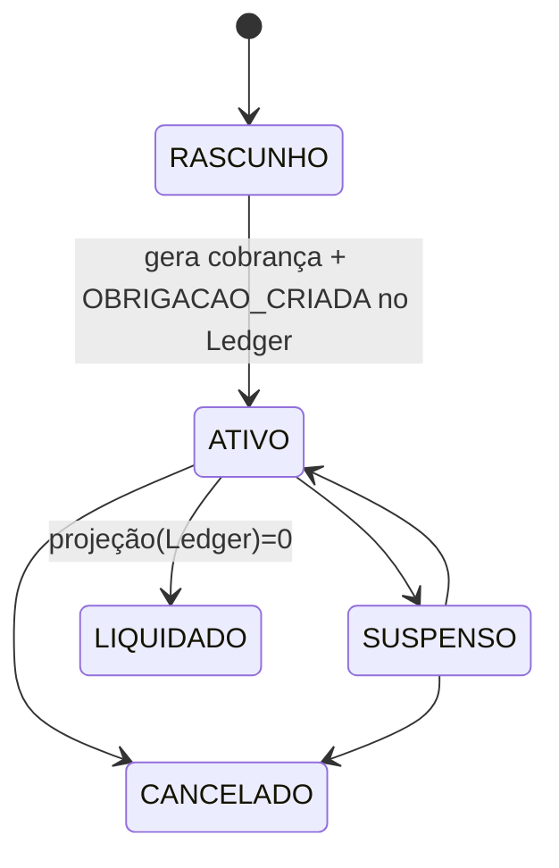
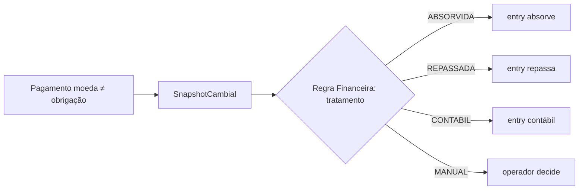

# Motor Financeiro Discovery — Especificação Definitiva (v3 · BASELINE OFICIAL CONGELADA)

> **Escopo:** especificação. **Não é implementação.** Fonte oficial para gerar tarefas técnicas.
> **Status:** arquitetura **CONGELADA** — baseline oficial do Discovery. A implementação inicia pela **Fase 1** a partir deste documento.
> **Regra mestra:** evolução **100% aditiva** — sem migration destrutiva, sem perda de dados, sem downtime, coexistência legado↔novo, histórico financeiro **imutável**, idempotência e transações atômicas em toda escrita.

### Changelog v3 (decisões finais + princípios)
- **Ledger DOUBLE-ENTRY (partidas dobradas) desde a Fase 1** — toda ocorrência gera lançamentos contábeis **balanceados** (Σdébitos = Σcréditos), com plano de contas mínimo; **sem** ledger simplificado a migrar depois.
- **Snapshots = cache de desempenho** (criados por evento relevante + **rebuild total** do Ledger). O Ledger é a **única fonte oficial**; snapshot **nunca** é fonte de dados.
- **Backfill por DATA DE CORTE** + `LedgerOpeningBalance` (saldo inicial por obrigação na data de ativação; **não** reconstrói histórico antigo; legado preservado **só-leitura**).
- Novo capítulo **§0 Princípios de Implementação** (DDD, Aggregate Root, Domain Events, Outbox, CQRS seletivo, Idempotency Key, Optimistic Locking, Soft Delete, histórico imutável, efeito nasce de evento, escrita transacional, projeção reconstruível).

### Changelog v2 (9 ajustes aprovados)
1. **Ledger Financeiro imutável** como **única fonte de verdade**; saldos são **projeções** (nunca verdade primária). Novas entidades `LedgerFinanceiro`/`LedgerEntry` + política de replay/rebuild/snapshot.
2. **Identificador reutilizado:** sem `CTR`. A entidade única usa o **código operacional atual** (ex.: `REC-105`); a Posição Financeira exibe o mesmo id.
3. **Modelo financeiro único:** Receita e Custo **não** são estruturas diferentes — são valores de um enum `natureza` na entidade única de obrigação econômica.
4. **Crédito entre requerentes = informativo:** pagamento por terceiro requerente **não** cria obrigação interna automática.
5. **Pagador externo = `ParteExterna`** (sem `Pessoa` sombra), com vínculo ao processo.
6. **Conciliação → Fase 2.** Fase 1 constrói só o motor; arquitetura prevê a integração futura.
7. **Diferença cambial configurável** pela **Regra Financeira** (ABSORVIDA|REPASSADA|CONTÁBIL|MANUAL) — nunca fixa no código.
8. **Menores: exclusão manual.** Idade nunca define participação; qualquer combinação é válida.
9. **Timeline Financeira = principal visão operacional**, cobrindo todo o ciclo (recibo, NF, cancelamento, estorno, renegociação, diferença cambial, conciliação).

## Índice
**0. Princípios de Implementação** · 1. Resumo · 2. Diagnóstico · 3. Modelo proposto · 4. Ledger (fonte da verdade) · 5. Entidades · 6. Relacionamentos · 7. Máquinas de estado · 8. Regras · 9. Eventos · 10. Telas · 11. Automações · 12. Permissões · 13. Relatórios · 14. Migração · 15. Casos de uso · 16. Diagramas · 17. ADRs · 18. Riscos · 19. Perguntas abertas · 20. Plano por fases · 21. Aceite

---

## 0. Princípios de Implementação (obrigatórios)

> Regras de engenharia que governam **toda** a implementação do motor. Congeladas na V3.

1. **DDD (onde aplicável):** o domínio financeiro é modelado com linguagem ubíqua (Obrigação Econômica, Ocorrência, Ledger, Entry, Aplicação, Distribuição, Pagador). Regras de negócio ficam no domínio, não em controllers/rotas.
2. **Aggregate Root:** a **`ObrigacaoEconomica` é o aggregate root** do seu ciclo financeiro. Cobranças, parcelas, ocorrências, entries e projeções daquela obrigação só mudam **através do aggregate** (consistência transacional por agregado). O `LedgerFinanceiro` da obrigação faz parte do agregado.
3. **Domain Events:** **todo efeito financeiro nasce de um evento de domínio** (`PagamentoRegistrado`, `OcorrenciaProcessada`, `ObrigacaoRenegociada`…). Nenhuma projeção/automação é disparada por chamada direta — só por evento.
4. **Outbox Pattern:** eventos publicados via **outbox transacional** (`DomainOutbox` existente): o evento e a escrita do domínio commitam juntos; o dispatcher entrega **at-least-once** com idempotência no consumidor.
5. **CQRS seletivo:** separar **escrita** (agregado + Ledger, normalizado) de **leitura** (projeções/materializações: `SaldoProjecao`, Posição Financeira, relatórios). CQRS **apenas onde agrega valor** (leitura de alto tráfego) — não virar dogma em telas simples.
6. **Idempotency Key em todas as ocorrências:** cada `OcorrenciaFinanceira` e cada `LedgerEntry` carrega `idempotencyKey` única; reprocessar o mesmo fato **não duplica** ocorrência, entries nem projeção.
7. **Optimistic Locking:** o aggregate carrega `version` (número de versão otimista); escritas concorrentes na mesma obrigação detectam conflito (`version` mismatch → retry), evitando corrida de saldo.
8. **Soft Delete onde necessário:** cadastros (ex.: `ParteExterna`, políticas) usam `ativo/desativadoEm`; **histórico financeiro nunca é deletado** (nem soft) — só estornado por nova ocorrência.
9. **Histórico financeiro imutável:** entries e ocorrências são **append-only**; proibido UPDATE/DELETE de efeito financeiro. Correção = novo lançamento.
10. **Escrita transacional:** ocorrência → entries (balanceados) → atualização de projeção materializada ocorrem em **uma transação atômica**; falha = rollback total.
11. **Projeção reconstruível:** **toda** projeção (saldo, status, posição, relatório) deve poder ser **reconstruída integralmente** a partir do Ledger (replay), sem depender de estado materializado — que é só cache.
12. **Fronteira config × operação:** configuração administrativa (regras, taxas, condições, plano de contas, políticas) é separada da operação diária (registrar fatos). O operador nunca configura durante a operação.

---

## 1. Resumo executivo

`Obrigação Econômica (única) → Obrigações de cobrança → Ocorrências → **Ledger** → Projeções (saldo/posição)`.

- Uma **entidade única** de obrigação econômica (`ObrigacaoEconomica`) representa **Receita, Custo e todos os tipos** via enum `natureza`. Reutiliza o **código operacional atual** (REC-n / os códigos já usados) — sem novo identificador.
- Toda ocorrência gera **lançamentos imutáveis no Ledger**. O **Ledger é a única fonte de verdade**; **saldo/status são projeções** reconstruíveis (replay).
- O operador **registra fatos**; o motor aplica regra, câmbio, distribuição, liquidação, saldo, auditoria, timeline.
- **Distribuição econômica (quem participa) é independente do pagador (quem paga).** Crédito entre requerentes é **informativo**.

---

## 2. Diagnóstico do modelo atual

| Hoje | Limitação | Ajuste v2 |
|---|---|---|
| `Receita`/`Custo` estruturas separadas | duplica regras | **entidade única + enum `natureza`** (Ajuste 3) |
| `Cobranca` criada por botão "Gerar Cobrança" | operação manual | geração automática (Fase final) |
| Pagamento embutido na parcela; saldo como coluna | sem ledger, sem parcial/pagador/aplicação | **Ledger fonte da verdade** (Ajuste 1) |
| Câmbio com snapshot em `Cobranca` | sem diferença separada nem política configurável | **política pela Regra Financeira** (Ajuste 7) |
| Sem pagador externo | forçaria `Pessoa` | **`ParteExterna`** (Ajuste 5) |
| Sem conciliação | — | **Fase 2** (Ajuste 6) |

**Ativos preservados/reusados:** `charge-calculation-service` (gross-up, política de taxas, cronograma por mês de calendário), `charge-runtime`, `gerarCronograma`, `cotacao-resolver`, snapshots de `Cobranca`, `CondicaoPagamento`/`TaxaPagamento`/`FormaPagamentoCadastro`/`CotacaoCambio`, `DomainOutbox`, `LogAuditoria`, idempotência (`Cobranca.idempotencyKey`).

---

## 3. Modelo proposto



Camadas: **Obrigação Econômica** (o quanto/de quem) · **Cobrança/Parcelas** (como cobrar) · **Ocorrências** (fatos) → **Ledger** (verdade imutável) → **Projeções** (saldo/posição/relatórios).

---

## 4. Ledger Financeiro — a única fonte da verdade (Ajuste 1)

> **Princípio explícito:** *o Ledger é a única fonte de verdade; os saldos são apenas projeções.* Nenhuma operação altera saldo persistido diretamente — toda operação **acrescenta lançamentos imutáveis** ao Ledger.

### 4.1. `LedgerFinanceiro`
- **Finalidade:** livro-razão financeiro por obrigação econômica (agrega os entries). **Campos:** `id`, `obrigacaoId`, `moedaContabil`(BRL), `criadoEm`. 1—N `LedgerEntry`.

### 4.2. `LedgerEntry` (imutável, append-only, **DOUBLE-ENTRY**) *(Decisão 1 · V3)*
- **Finalidade:** uma **perna** de um lançamento contábil balanceado.
- **Campos:** `id`, `ledgerId`, `obrigacaoId`, `parcelaId?`, `ocorrenciaId`(correlação), `transacaoId`(agrupa as pernas de um mesmo lançamento), `tipo`(§4.4), **`contaContabil`** (código do plano de contas §4.8), **`direcao`(DEBITO|CREDITO)**, `valor`, `moeda`, `valorContabil`(BRL via snapshot), `snapshotCambialId?`, `data`, `sequencia`(monotônica por ledger), `estornaEntryId?`, `idempotencyKey`, `correlacaoId`, `criadoPorId`, `criadoEm`.
- **Imutabilidade:** **nunca** update/delete. Correção = **novo lançamento** (estorno/ajuste) apontando `estornaEntryId`.

### 4.3. Regras de geração (partidas dobradas)
- **Fonte única = ocorrência.** Toda `OcorrenciaFinanceira` PROCESSADA gera **um lançamento contábil** (`transacaoId`) com **2..N pernas** (`LedgerEntry`) na **mesma transação de banco**.
- **Invariante de balanceamento:** por `transacaoId`, **Σdébitos = Σcréditos** (em `valorContabil`). Lançamento não-balanceado é rejeitado (guard no domínio).
- **Exemplos (contas do §4.8):**
  - *Obrigação criada (a receber):* D `1.1 Clientes a Receber` / C `4.1 Receita a Realizar`.
  - *Pagamento:* D `1.0 Caixa/Banco` / C `1.1 Clientes a Receber` (+ D `5.1 Taxas` / C `1.1` quando há taxa; + perna de `6.1 Diferença Cambial` conforme política).
  - *Desconto:* D `4.2 Descontos` / C `1.1 Clientes a Receber`.
  - *Juros/Multa:* D `1.1 Clientes a Receber` / C `4.3 Encargos`.
  - *Estorno:* pernas **inversas** da original (novo lançamento, nunca delete).
- **Idempotência:** `(ocorrenciaId, transacaoId, contaContabil, direcao)` único; `idempotencyKey` por lançamento. Reprocessar **não duplica**.
- **Consistência transacional:** ocorrência + pernas + atualização de projeção materializada em **uma transação**; falha → rollback total (sem entry/lançamento órfão).

> **Nota de escopo:** double-entry desde a Fase 1 (Decisão 1) elimina migração estrutural futura. O **plano de contas começa mínimo** (§4.8) e é extensível sem mudar o modelo.

### 4.4. Tipos de lançamento (entry types)
`OBRIGACAO_CRIADA` · `PAGAMENTO` · `PAGAMENTO_PARCIAL` · `ESTORNO` · `DESCONTO` · `JUROS` · `MULTA` · `REEMBOLSO` · `CREDITO` · `RENEGOCIACAO` · `DIFERENCA_CAMBIAL` · `CANCELAMENTO` · `BAIXA` · `CONCILIACAO`(Fase 2) · `AJUSTE`. Cada tipo declara `direcao` e efeito na projeção.

### 4.5. Projeções (saldo/status)
- **Saldo** e **status** (obrigação, parcela, contrato) são **derivados** por replay dos entries.
- **Materialização (cache):** tabela de projeção `SaldoProjecao(obrigacaoId, recebidoBruto, recebidoLiquido, saldo, vencido, aVencer, ultimaSequenciaAplicada)` — **reconstruível**, atualizada incrementalmente a cada entry.
- **Projeção sob demanda vs. materializada:** telas de alto tráfego (lista de posições) leem a **materializada**; auditoria/detalhe pode **projetar sob demanda** (replay) para conferência. Divergência materializada↔replay dispara alerta.

### 4.6. Reconstrução / replay / snapshots (Decisão 2 · V3)
- **Replay:** aplicar entries em ordem de `sequencia` reconstrói qualquer saldo/status a partir do `LedgerOpeningBalance` (§4.8). O **Ledger é a única fonte oficial**.
- **`SaldoSnapshot` = cache de desempenho, nunca fonte de dados.** Criado **automaticamente por evento relevante** (pagamento, estorno, renegociação, ajuste etc.) e opcionalmente por corte de data. Guarda `obrigacaoId`, `sequenciaAplicada`, saldos derivados.
- **Rebuild total:** replay do zero (a partir do opening balance) é **idempotente**, executável online/offline; usado em migração, correção de bug de projeção e verificação periódica. Snapshot é sempre descartável/recriável.
- **Compensação:** erro em ocorrência já projetada = **novo lançamento de estorno/ajuste** (nunca editar) — a trilha é preservada.

### 4.7. Desempenho / índices / auditoria
- **Índices:** `LedgerEntry(ledgerId, sequencia)`, `(transacaoId)`, `(obrigacaoId, data)`, `(ocorrenciaId)`, `(idempotencyKey unique)`, `(contaContabil, data)`.
- **Auditoria:** cada entry referencia ocorrência + usuário; `LogAuditoria` registra estado anterior/posterior das projeções. **Sem exclusão física.**

### 4.8. Plano de contas mínimo + `LedgerOpeningBalance` (Decisão 3 · V3)
- **`PlanoContaFinanceira`** (cadastro extensível): `codigo`, `nome`, `tipo`(ATIVO|PASSIVO|RECEITA|DESPESA|RESULTADO), `ativo`. Conjunto **mínimo inicial** (extensível sem mudar o modelo):
  `1.0 Caixa/Banco` · `1.1 Clientes a Receber` · `2.1 Fornecedores/Custos a Pagar` · `4.1 Receita a Realizar` · `4.2 Descontos` · `4.3 Encargos (juros/multa)` · `5.1 Taxas/Tarifas` · `6.1 Diferença Cambial` · `7.1 Créditos de Clientes` · `9.9 Saldo de Abertura`.
- **`LedgerOpeningBalance` (data de corte):** na **data de ativação**, para cada obrigação viva, o motor **calcula o saldo inicial** (do estado legado) e grava **um lançamento de abertura balanceado** (ex.: D `1.1 Clientes a Receber` / C `9.9 Saldo de Abertura`). Campos: `obrigacaoId`, `dataCorte`, `valorAbertura`, `moeda`, `transacaoId`, `origem`("backfill-corte").
- **Regra:** **a partir da data de corte, toda nova ocorrência passa OBRIGATORIAMENTE pelo Ledger.** O histórico anterior à data de corte **não é reconstruído** — permanece **só-leitura** no modelo legado (consulta), e o saldo daquele ponto entra como abertura. Isso reduz risco/tempo/complexidade preservando todos os dados.

---

## 5. Entidades

> **N**=novas (aditivas), **R**=reuso/estende. Toda nova nasce com `criadoEm/atualizadoEm`, `criadoPorId?`, `idempotencyKey` quando aplicável.

### 5.1. `ObrigacaoEconomica` (N — entidade ÚNICA, raiz) *(Ajustes 2 e 3)*
- **Finalidade:** obrigação econômica única para **todos** os tipos.
- **Identidade (Ajuste 2):** **reutiliza o código operacional atual** — `codigoOperacional` = código da Receita/Custo (ex.: `REC-105`). PK interna é surrogate; o **usuário sempre vê o mesmo id de hoje**. **Não** existe `CTR`.
- **Natureza (Ajuste 3):** `natureza` enum = RECEITA | CUSTO | RECEITA_EXTRA | LANCAMENTO_EXTRA | DESCONTO | CREDITO | REEMBOLSO | JUROS | MULTA | AJUSTE | ESTORNO | RENEGOCIACAO | OUTRO. `direcao` = A_RECEBER | A_PAGAR (derivada da natureza). **Receita e Custo deixam de ser estruturas distintas.**
- **Campos:** `id`, `codigoOperacional`, `natureza`, `direcao`, `processoId?`, `faseId?`, `clienteId?`, `regraFinanceiraId?`, `moedaContratual`, `moedaContabil`(BRL), `valorContratado`, `politicaCambialId?`, `politicaDivisao`, `contaContabilId?`, `centroCustoId?`, `status`, `versao`, `substituiId?`, `origemTipo`(Receita|Custo|nativo), `origemId?`, `observacoes?`.
- **Relacionamentos:** 1—N Cobrança; 1—N Distribuição; 1—1 Ledger; 1—N versões (self); 1—N ResponsavelContratual.
- **Imutabilidade/versionamento:** valor/moeda congelados por versão; renegociação → versão+1 (`substituiId`). **Compat:** `origemTipo/origemId` = 1:1 com Receita/Custo (backfill).

### 5.2. `ObrigacaoCobranca` (R = `Cobranca` + `obrigacaoId`)
"Como/quando cobrar". Estados: PENDENTE/ABERTA/PARCIAL/VENCIDA/QUITADA/CANCELADA/RENEGOCIADA. Snapshots (câmbio/condição), `idempotencyKey`.

### 5.3. `ParcelaFinanceira` (R)
Unidade de vencimento; `saldoAberto` **derivado do Ledger**.

### 5.4. `OcorrenciaFinanceira` (N — gatilho dos entries) *(generaliza `EventoFinanceiro`)*
Fato registrado pelo operador/motor. Gera entries no Ledger (não altera saldo direto). Campos: `id`, `obrigacaoId`, `cobrancaId?`, `tipo`, `valor`, `moeda`, `data`, `formaPagamentoId?`, `origemRecurso`, `pagadorId?`, `snapshotCambialId?`, `comprovanteUrl?`, `observacao?`, `politicaAplicacao`, `status`, `estornaId?`, `correlacaoId`, `idempotencyKey`, `criadoPorId`. Estados: PENDENTE/PROCESSANDO/PROCESSADA/REJEITADA/REVERTIDA.

### 5.5. `AplicacaoFinanceira` (N)
A quais parcelas/obrigações a ocorrência foi imputada (**nunca implícito**).

### 5.6. `Pagamento` (N — especialização de Ocorrência)
Dados bancários; `valorBruto/valorTarifa?/valorLiquido`, `contaRecebimentoId?`, `identificadorTransacao?`. Estados: INFORMADO/PROCESSADO/AGUARDANDO_CONCILIACAO/CONCILIADO/DIVERGENTE/ESTORNADO/CANCELADO.

### 5.7. `DistribuicaoEconomica` + `ParticipacaoEconomica` (N) *(Ajuste 8)*
Modo SEM_DIVISAO|IGUAL|PERCENTUAL|VALOR|GRUPO|PERSONALIZADA; participação por `pessoaId` com `incluido`. **Exclusão de menores é manual** — idade nunca define participação; **qualquer combinação é válida**. Validação Σ=100% (ou Σvalores=valor); centavos na última cota; `saldoEconomico` derivado do Ledger.

### 5.8. `Pagador` (N) + `ParteExterna` (N) *(Ajuste 5)*
`Pagador`: `tipo`(REQUERENTE|EMPRESA|TERCEIRO|EXTERNO), `pessoaId?`, `parteExternaId?`. `ParteExterna`: `id`, `nome`, `documento?`, `tipo`(PF|PJ), `observacao?`, `processoId?` (vínculo com o processo). **Sem `Pessoa` sombra; sem poluir o cadastro principal.**

### 5.9. `ResponsavelContratual` (N)
`obrigacaoId`, `pessoaId`, `principal`.

### 5.10. `PoliticaCambial` (N) + `SnapshotCambial` (N) *(Ajuste 7)*
`PoliticaCambial`: escopo (CONTRATO|OBRIGACAO), tipo (FIXO|VARIAVEL|SNAPSHOT|MESMA|MANUAL), `permiteOverride`, `fonteDefault`, **`tratamentoDiferenca`** (ABSORVIDA|REPASSADA|CONTABIL|MANUAL) — **definido pela Regra Financeira, nunca fixo em código.** `SnapshotCambial`: moedaOrigem/Destino, taxa, direcao, fonte, tipo, data/hora, usuário?, justificativa?, precisao, `valorOriginal`, `valorRecebido`, `diferencaCambial`, `tratamentoDiferenca`, `motivo?`.

### 5.11. `ContaRecebimento` (R) · `RegraFinanceira` (R) · `EventoFinanceiro/DomainOutbox` (R) · `AuditoriaFinanceira` (R = `LogAuditoria`)
Reuso; a Regra Financeira passa a carregar a **política de diferença cambial** e a distribuição default.

### 5.12. `CreditoFinanceiro` (N) *(Ajuste 4)*
Excedente/crédito. **Crédito entre requerentes é informativo:** pagamento por terceiro requerente **não** cria obrigação interna — registra `pagoEmNomeDeTerceiros` para exibição. Cobrança posterior entre requerentes = **novo lançamento explícito** (`ObrigacaoEconomica` natureza=OUTRO). Destinos do excedente próprio: CREDITO|ADIANTAMENTO|QUITAR_OUTRO|DEVOLUCAO — sempre explícitos.

### 5.13. `ConciliacaoFinanceira` (N — **Fase 2**) *(Ajuste 6)*
Definida na arquitetura; **implementada só na Fase 2**. Fase 1 não concilia.

---

## 6. Relacionamentos (ER)



---

## 7. Máquinas de estado

**Obrigação Econômica:** RASCUNHO → ATIVO → SUSPENSO → LIQUIDADO | CANCELADO (LIQUIDADO quando **projeção do Ledger** zera).
**Cobrança/Parcela:** PENDENTE → ABERTA → PARCIAL | VENCIDA → QUITADA | CANCELADA | RENEGOCIADA.
**Pagamento:** INFORMADO → PROCESSADO → AGUARDANDO_CONCILIACAO → CONCILIADO | DIVERGENTE → ESTORNADO (conciliação = **Fase 2**).
**Ocorrência:** PENDENTE → PROCESSANDO → PROCESSADA | REJEITADA → REVERTIDA.


Toda transição: gatilho → bloqueio (permissão/estado) → **entry no Ledger** → projeção → evento (outbox) → auditoria.

---

## 8. Regras (invariantes)

1. **Ledger = única fonte de verdade;** saldo/status = **projeção**. 2. Entries **imutáveis**; correção = novo entry. 3. Ocorrência **nunca** altera saldo direto — só gera entries. 4. Entidade de obrigação **única** (`natureza` enum). 5. **Código operacional reutilizado** (REC-n). 6. Distribuição **≠** pagador; crédito entre requerentes **informativo**. 7. Aplicação **explícita**. 8. Diferença cambial **configurável pela Regra Financeira**. 9. Menores **manual**. 10. Snapshots imutáveis. 11. Forma validada contra **moeda de recebimento**. 12. Escrita **transacional + idempotente + auditada**; sem exclusão física.

---

## 9. Eventos (catálogo de ocorrências → entries)

PAGAMENTO/PARCIAL/ANTECIPADO/ATRASO · DESCONTO · MULTA · JUROS · ESTORNO(total/parcial) · REEMBOLSO/DEVOLUCAO · BAIXA · AJUSTE · DIFERENCA_CAMBIAL · RENEGOCIACAO · CANCELAMENTO · CREDITO/COMPENSACAO/TRANSFERENCIA · EMISSAO_NF · RECIBO · CONCILIACAO(**Fase 2**). Cada uma gera entry(ies) e evento de domínio (outbox).

---

## 10. Telas

**Posição Financeira** (substitui "Dossiê da Receita"; usa o **mesmo id REC-n**). Prioriza: contratado, cobrado, recebido bruto/líquido, saldo, vencido, a vencer, próximo vencimento, diferença cambial, taxas, descontos, créditos, status, **próxima ação (UMA)**.
Estrutura: (1) Cabeçalho financeiro · (2) Pipeline do ciclo · (3) Obrigações/parcelas · (4) **Timeline Financeira — visão operacional principal (Ajuste 9)** · (5) Posição por requerente · (6) Pagamentos · (7) Documentos · (8) Próxima ação inteligente. *(Conciliação aparece na Fase 2.)*
**Timeline (Ajuste 9):** ordem cronológica de todo o ciclo — contrato criado, cobrança criada/enviada, pagamento, aplicação, desconto, juros/multa, **diferença cambial**, estorno, renegociação, cancelamento, baixa, **recibo**, **nota fiscal**, **conciliação (Fase 2)**.
**Registrar Ocorrência/Pagamento:** modal adaptativo por tipo (o quê/quanto/quando/como/comprovante/observação); motor resolve o resto. Sem wizard, sem tela vazia, uma ação principal, BRL em destaque + moeda contratual preservada, identidade Discovery.

---

## 11. Automações
Após ocorrência PROCESSADA (via `DomainOutbox`, at-least-once + idempotência): gerar entries → atualizar projeções (saldo/status) → timeline → dashboards → auditoria → relatórios. Retries com backoff; compensação por novo entry; observabilidade por tipo; projeções reconstruíveis (rebuild).

## 12. Permissões
Estende `permissoes.ts`: `financeiro.lancamento_extra`, `.editar_distribuicao`, `.registrar_pagamento`, `.escolher_aplicacao`, `.pagador_externo`, `.alterar_data`, `.cambio_manual`, `.conceder_desconto`, `.aplicar_credito`, `.estornar`, `.renegociar`, `.cancelar`, `.reabrir_saldo`, `.alterar_responsavel` (`.conciliar` → Fase 2).

## 13. Relatórios
Por processo · por requerente (participação × pago × **pago em nome de terceiros**, informativo) · por pagador (incl. ParteExterna) · por obrigação · por caixa (bruto/líquido/taxas/impostos/**diferença cambial**). **Todos derivados do Ledger** (consistência por reconciliação replay↔materializada).

---

## 14. Migração (5 fases, sem downtime) — resumo (detalhe em §20)
Fase 1 **motor + Ledger double-entry** (tabelas aditivas, escrita dupla) · Fase 2 **conciliação** · Fase 3 **ativação por data de corte** (`LedgerOpeningBalance`, sem reconstruir histórico) · Fase 4 leitura nova+fallback · Fase 5 consolidação.

---

## 15. Casos de uso (destaques revisados)
1. **4 requerentes, 1 paga tudo:** distribuição IGUAL; Pagamento(pagador=req1, total) → entries CREDITO nas parcelas; projeção zera saldo; `CreditoFinanceiro.pagoEmNomeDeTerceiros`=R$7.500 **informativo** — **nenhuma conta a receber interna** (Ajuste 4). 2. pago por outro req → idem, informativo. 4. extra personalizado (qualquer combinação, menores manual — Ajuste 8). 7/8. EUR fixo/variável → tratamento de diferença **pela Regra Financeira** (Ajuste 7). 9. excedente → `CreditoFinanceiro` destino explícito. 10. estorno parcial → **novo entry** (Ledger imutável). 11. renegociação → nova versão. 20. externo paga → `ParteExterna` (Ajuste 5). *(Conciliação divergente = Fase 2.)* Os 20 casos completos permanecem, ajustados aos 9 itens.

---

## 16. Diagramas

**Pagamento (com Ledger)**
```mermaid
flowchart LR
  A[Registrar ocorrência PAGAMENTO] --> B[Motor: conta/cotação/conversão]
  B --> C{Aplicação explícita}
  C --> D[AplicacaoFinanceira]
  D --> E[Gera LedgerEntry(s) imutáveis]
  E --> F{Excedente?}
  F -- sim --> G[CreditoFinanceiro destino explícito]
  E --> H[Atualiza projeção saldo/status]
  H --> I[Outbox + auditoria + Timeline]
```
**Diferença cambial (configurável)**

**Rebuild de projeção**

(Diagramas conceitual, ER, estados, criação, estorno, renegociação e migração no restante do documento.)

---

## 17. ADRs

| ADR | Decisão | Justificativa |
|---|---|---|
| **ADR-1** Obrigação econômica **única** (`natureza` enum) | Receita/Custo/… num só modelo | elimina duplicação (Ajuste 3) |
| **ADR-2** **Ledger = fonte da verdade**; saldo=projeção | entries imutáveis + replay | histórico imutável, reconstrução, auditoria (Ajuste 1) |
| **ADR-3** **Reutilizar código operacional** (REC-n) | sem CTR | continuidade p/ usuários e integrações (Ajuste 2) |
| **ADR-4** Distribuição ≠ pagador; **crédito informativo** | tabelas separadas; sem obrigação interna automática | cenários A–F; cobrança interna só explícita (Ajuste 4) |
| **ADR-5** **`ParteExterna`** para pagador externo | sem `Pessoa` sombra | não poluir cadastro (Ajuste 5) |
| **ADR-6** Aplicação **explícita** | AplicacaoFinanceira sempre | evita imputação implícita |
| **ADR-7** Câmbio: snapshot + **diferença configurável** | política na Regra Financeira | nunca comportamento fixo (Ajuste 7) |
| **ADR-8** **Conciliação na Fase 2** | Fase 1 = motor | foco e menor risco (Ajuste 6) |
| **ADR-9** Idempotência universal | idempotencyKey por ocorrência e entry | retry seguro |
| **ADR-10** Coexistência legado | origemTipo/origemId + escrita dupla + fallback | zero downtime |
| **ADR-11** Geração automática de obrigações | contrato nasce ativo; "gerar cobrança" vira ADMIN | operação por fatos |
| **ADR-12** Renegociação por versão | nova versão + cancela futuras | preserva liquidado |
| **ADR-13** Distribuição de menores **manual** | idade nunca automática | qualquer combinação válida (Ajuste 8) |
| **ADR-14** **Timeline = visão operacional principal** | cobre todo o ciclo | operação centrada no ciclo financeiro (Ajuste 9) |
| **ADR-15** **Ledger DOUBLE-ENTRY desde a Fase 1** | toda ocorrência = lançamento balanceado (Σd=Σc) | consistência/rastreabilidade/extensibilidade; sem migração estrutural futura (Decisão 1) |
| **ADR-16** **Snapshots = cache, nunca fonte** | criados por evento + rebuild total do Ledger | Ledger é a única verdade; projeção descartável (Decisão 2) |
| **ADR-17** **Backfill por data de corte + `LedgerOpeningBalance`** | não reconstruir histórico; saldo inicial na ativação | reduz risco/tempo/complexidade; legado só-leitura (Decisão 3) |
| **ADR-18** **Princípios de implementação (§0)** | DDD/Aggregate/Domain Events/Outbox/CQRS seletivo/Idempotência/Optimistic Lock/Soft Delete/imutável/transacional/reconstruível | disciplina de engenharia congelada na V3 |

---

## 18. Riscos
Reconciliação legado↔novo (guard de paridade por obrigação) · divergência projeção↔replay (job + alerta) · concorrência de sessões/branch (commits cedo, flags, deploy por fase) · volume do Ledger (índices + snapshots de saldo) · UI adaptativa (regra de exibição separada da de cálculo).

## 19. Perguntas abertas — **resolvidas pelos 9 ajustes**
- Custo unificado? **Sim** (natureza=CUSTO). · Crédito entre requerentes? **Informativo** (Ajuste 4). · Conciliação? **Fase 2** (Ajuste 6). · Pagador externo? **`ParteExterna`** (Ajuste 5). · Identificador? **Reusa REC-n** (Ajuste 2). · Diferença cambial? **Configurável pela Regra Financeira** (Ajuste 7). · Menores? **Manual** (Ajuste 8). · NF/Recibo? **Ocorrências documentais na Timeline** (Ajuste 9).
**Decisões finais V3 (congeladas):** (a) **partida dobrada** (double-entry balanceado) desde a Fase 1 — ADR-15; (b) **snapshots = cache** por evento + rebuild — ADR-16; (c) **backfill por data de corte** com `LedgerOpeningBalance` — ADR-17. **Nenhuma pergunta em aberto — arquitetura congelada.**

## 20. Plano de implementação por fases

**Fase 1 — Motor + Ledger double-entry (aditivo, legado ativo)**
Migrations aditivas: `ObrigacaoEconomica`(reusa código), `DistribuicaoEconomica`, `ParticipacaoEconomica`, `OcorrenciaFinanceira`, `AplicacaoFinanceira`, `LedgerFinanceiro`, `LedgerEntry`(double-entry), `PlanoContaFinanceira`, `LedgerOpeningBalance`, `SaldoProjecao`, `SaldoSnapshot`, `Pagador`, `ParteExterna`, `PoliticaCambial`, `SnapshotCambial`, `CreditoFinanceiro` + `Cobranca.obrigacaoId`. Guard de domínio: **todo lançamento balanceado (Σd=Σc)**. **Escrita dupla** (fatos novos geram ocorrência + lançamento balanceado). Flags: `off`→`dual-write`. Rollback: desligar flag. Métrica: % de fatos espelhados + 0 lançamentos desbalanceados. Avanço: 100% espelhado + guards de schema/balanceamento. **Sem conciliação.**

**Fase 2 — Conciliação** (`ConciliacaoFinanceira`, integração com Extratos, entries `CONCILIACAO`).

**Fase 3 — Ativação por DATA DE CORTE (sem reconstruir histórico) — Decisão 3:** escolher a **data de ativação**; para cada obrigação viva, projetar o saldo do estado legado e gravar **`LedgerOpeningBalance`** (lançamento de abertura balanceado). A partir do corte, **toda nova ocorrência passa pelo Ledger**. Histórico anterior fica **só-leitura** no legado. Guard: para cada obrigação, `saldo_abertura (Ledger) == saldo_legado (na data de corte)` = 100%. Rollback: reexecutar o corte (idempotente). Avanço: abertura conferida em 100%.

**Fase 4 — Leitura nova + fallback:** Posição Financeira e relatórios leem projeções do Ledger; fallback ao legado. Flag `read-new`. Avanço: 0 divergências por N dias.

**Fase 5 — Consolidação:** nascimento automático (some "Gerar Cobrança"), ocorrências ricas, Timeline principal, legado só-leitura.

Cada fase: migrations aditivas · feature flag · riscos · rollback · métricas · validação · critério de avanço.

## 21. Critérios de aceite
Zero destrutivo/zero perda · legado funcional em todas as fases · **Ledger double-entry como única verdade + replay reconstrói 100%** · **todo lançamento balanceado (Σd=Σc)** · **`LedgerOpeningBalance` conferido = saldo legado na data de corte** · snapshots só cache (rebuild recria) · cenários A–F e 20 casos testados · entidade única por natureza · **id REC-n preservado** · crédito entre requerentes informativo · diferença cambial pela Regra Financeira · menores manual · Timeline cobre todo o ciclo · **princípios §0 respeitados** (DDD/Aggregate/Domain Events/Outbox/Idempotência/Optimistic Lock/imutabilidade/transacional/reconstruível) · idempotência comprovada · tsc/build/testes verdes · deploy por fase reversível.

---

**Arquitetura CONGELADA — V3 é a baseline oficial do Discovery.** Sem perguntas em aberto. Ao seu comando, inicio a **Fase 1** (motor + Ledger double-entry, puramente aditivo, sem tocar em dados nem quebrar o existente).
